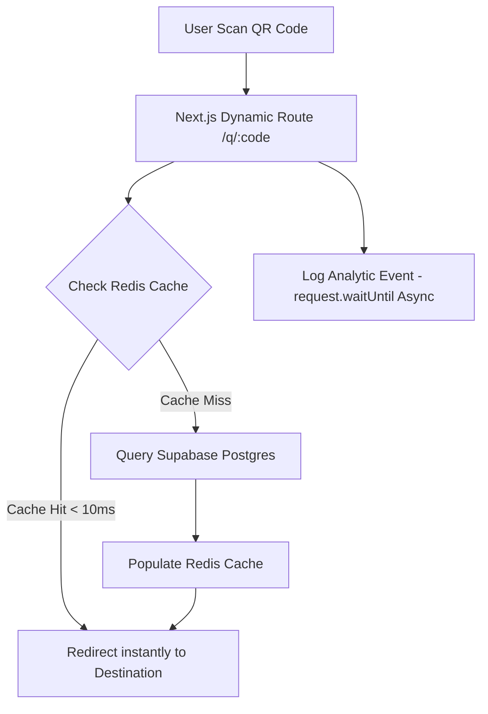

# ⚡ QRCup (คิวอาร์คัพ)

[](https://opensource.org/licenses/MIT)
[](https://nextjs.org/)
[](https://supabase.com/)
[](https://upstash.com/)
[](https://stripe.com/)

**QRCup (คิวอาร์คัพ)** คือแพลตฟอร์ม Dynamic QR Code Micro-SaaS ยุคใหม่สไตล์ B2B Minimalist สำหรับผู้ประกอบการ SMEs, ร้านค้าออนไลน์, ครีเอเตอร์ และธุรกิจต่างๆ ในไทย ช่วยให้คุณสร้างคิวอาร์โค้ดครั้งเดียว แต่ปรับเปลี่ยนลิงก์ปลายทางเมื่อไหร่ก็ได้ตลอดชีพ โดยไม่ต้องส่งพิมพ์ป้ายใหม่ ประหยัดต้นทุน 100% พร้อมระบบติดตามสถิติการสแกนและหลบหลีก LINE WebView Sandbox (สแกนเด้งเข้าแอปหลักทันที ไม่ค้างหน้าแชต)

---

## ✨ Features เด่น (ที่เหนือกว่า QR Code ทั่วไป)

*   **🔄 เปลี่ยนลิงก์ปลายทางได้ตลอดชีพ:** ปริ้นท์ป้ายติดหน้าร้านครั้งเดียว หากมีการย้ายหน้าร้าน, เปลี่ยนลิงก์สั่งซื้อ, หรืออัปเดตโปรโมชั่น สามารถเปลี่ยนลิงก์ปลายทางในระบบได้ทันที
*   **⚡ สแกนสปีดทะลุ LINE WebView (LINE Escape):** ปรับจูนระบบให้หลุดพ้นจากหน้าเบราว์เซอร์ภายในแอป LINE โดยอัตโนมัติ สแกนแล้วเด้งเข้าสู่เบราว์เซอร์หลักของมือถือหรือแอปปลายทางทันที
*   **📱 ระบบเรียกเปิดแอปพลิเคชันหลัก (Deep Linking Interstitial):** หากลิงก์ปลายทางเป็น Shopee, Lazada, TikTok, Instagram หรือ LINE ระบบจะรันผ่านหน้าสแปลชสกรีนเรียกเปิดแอปหลักนั้นๆ บนสมาร์ตโฟนทันที เพื่อเพิ่มยอดขายและอัตราการแปลงผล (Conversion Rate Rate)
*   **📊 สถิติการสแกนเชิงลึก (Analytics Dashboard):** แสดงข้อมูลการสแกนแบบเรียลไทม์ ยอดการสแกนรวม รายสัปดาห์ ประเภทของอุปกรณ์ (Mobile/Desktop) และเบราว์เซอร์ที่ใช้
*   **🔒 สิทธิ์การใช้งานระบบ 2 ระดับ (Free & Pro):**
    *   **แผนฟรี (Free Tier):** สร้างคิวอาร์โค้ดได้สูงสุด 3 โค้ด พร้อมสถิติพื้นฐาน สแกนได้ไม่จำกัดจำนวนครั้ง
    *   **แผนโปร (Pro Tier):** สร้างคิวอาร์โค้ดได้ไม่จำกัด, ล็อกบิสเนสลิงก์ไม่หลุด, ดาวน์โหลดความละเอียดสูง, ระบบสนับสนุนแบบพิเศษ (Priority Support) และการจัดการหลังบ้านขั้นสูง
*   **💎 ปลอดภัยสำหรับธุรกิจ (Scanner-Safety):** หากผู้ใช้ Pro ทำการดาวน์เกรดเป็น Free คิวอาร์โค้ดที่เคยสร้างไว้ทั้งหมดจะยังคงสแกนใช้งานได้ 100% (ไม่มีวันลิงก์เสีย) โดยระบบจะทำการล็อกเพียงสิทธิ์การแก้ไขชั่วคราวจนกว่าจะกลับมาใช้แผน Pro หรือลบโค้ดออกให้เหลือตามโควตา

---

## 🛠️ Technical Stack (เทคโนโลยีระดับพรีเมียม)



1.  **Frontend / Backend Framework:** [Next.js 16 (Turbopack)](https://nextjs.org/) - พัฒนาด้วยโครงสร้าง App Router และ Server Actions ให้ความเร็วสูงสุดในการโหลดหน้าเว็บ
2.  **Database & Auth:** [Supabase](https://supabase.com/) - ระบบลงทะเบียนเข้าใช้งาน (Supabase Auth) และเก็บข้อมูลตารางคิวอาร์โค้ด (Supabase Postgres) พร้อมระบบความปลอดภัยด้วยสิทธิ์ RLS (Row Level Security)
3.  **High-Speed Cache:** [Upstash Redis](https://upstash.com/) - เซิร์ฟเวอร์เก็บ Cache ข้อมูลทราฟฟิกลิงก์ปลายทาง ช่วยให้การสแกนและเปลี่ยนเส้นทาง (Redirection) ทำได้ด้วยความเร็วสูงกว่าปกติ (น้อยกว่า 50ms)
4.  **Payment Gateway:** [Stripe Payments](https://stripe.com/) - ระบบชำระเงินค่าสมัครสมาชิกแบบรายเดือน (฿129) และรายปี (฿990) เชื่อมโยงผ่าน Stripe Checkout และอัปเดตข้อมูลด้วยระบบ Stripe Webhooks
5.  **QR Code Engine:** [node-qrcode](https://github.com/soldair/node-qrcode) - ใช้การสร้างคิวอาร์โค้ดแบบ Base62 สั้นเพียง 5-6 ตัวอักษร เพื่อให้เมทริกซ์ของคิวอาร์โค้ดมีความหนาแน่นต่ำ สแกนติดง่ายมากแม้ถูกพิมพ์บนฉลากขนาดเล็ก

---

## 🚀 วิธีการเริ่มติดตั้งและรันในเครื่องตัวเอง (Local Development)

### 1. โคลนโปรเจกต์ลงมาในเครื่อง
```bash
git clone https://github.com/ชื่อผู้ใช้ของคุณ/qrcup.git
cd qrcup
```

### 2. ติดตั้ง Dependencies
```bash
npm install
```

### 3. ตั้งค่าไฟล์ Environment Variables
สร้างไฟล์ `.env.local` ในโฟลเดอร์หลักของโปรเจกต์และเพิ่มข้อมูลดังต่อไปนี้:
```env
# Supabase Configuration
NEXT_PUBLIC_SUPABASE_URL=your_supabase_url
NEXT_PUBLIC_SUPABASE_ANON_KEY=your_supabase_anon_key
SUPABASE_SERVICE_ROLE_KEY=your_supabase_service_role_key

# Upstash Redis
UPSTASH_REDIS_REST_URL=your_upstash_redis_url
UPSTASH_REDIS_REST_TOKEN=your_upstash_redis_token

# Stripe Payments
STRIPE_SECRET_KEY=your_stripe_secret_key
NEXT_PUBLIC_STRIPE_PUBLISHABLE_KEY=your_stripe_publishable_key
NEXT_PUBLIC_STRIPE_PRO_PRICE_ID=price_1TZbk4AnNN8o8Qze09Vzv736
NEXT_PUBLIC_STRIPE_PRO_YEARLY_PRICE_ID=price_1TZbmlAnNN8o8QzedsrTSKbL
STRIPE_WEBHOOK_SECRET=your_stripe_webhook_signing_secret

# Application URL
NEXT_PUBLIC_APP_URL=http://localhost:3000
```

### 4. สตาร์ทโปรเจกต์ฝั่ง Local Dev
```bash
npm run dev
```
เปิดบราวเซอร์ไปที่ [http://localhost:3000](http://localhost:3000)

---

## 🔒 ลิขสิทธิ์ซอร์สโค้ด (License)

ซอร์สโค้ดในโปรเจกต์นี้อยู่ภายใต้สัญญาอนุญาต [MIT License](LICENSE) สามารถนำไปดัดแปลง แก้ไข หรือจำหน่ายต่อได้ตามสะดวกแบบไม่มีข้อผูกมัดเชิงพาณิชย์
